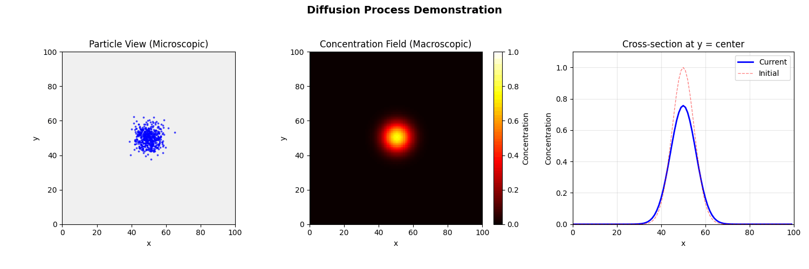
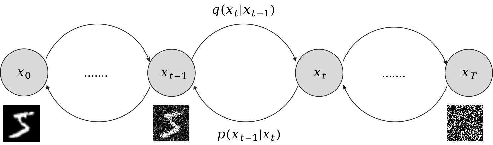

# Diffusion Models (DDPM)

Diffusion is the net movement of particles (atoms, ions, molecules, energy, etc.) from a region of higher concentration to a region of lower concentration. The figure below illustrates a diffusion process.

<div align="center">
  
</div>

---

## Diffusion in generative modeling

### High-dimensional data and the manifold hypothesis
To build intuition, consider images. Although an image can be represented as a point in a very high-dimensional space (e.g., a $128\times128$ grayscale image lives in $\mathbb{R}^{16384}$), only a small subset of these points correspond to “natural” images that humans recognize. This motivates the **manifold hypothesis**: natural images lie on (or near) a lower-dimensional manifold embedded in the high-dimensional pixel space. Equivalently, the data distribution concentrates most of its probability mass in a small region of the ambient space (a “high-density region”).

### Forward and reverse diffusion
A diffusion model defines:

- a **forward (noising) process** that gradually corrupts data by adding noise, pushing samples from high-density regions toward a simple noise distribution; and
- a **reverse (denoising) process** that learns to invert this corruption, transforming noise back into realistic samples.

<div align="center">
  
</div>

Here are two examples of forward diffusion on MNIST and CIFAR-10:

<div align="center">
  
  
</div>

---

## DDPM (Denosing Diffusion Probabilistic Models)

### Forward Process
A way to add noise to an image is generally adding Gaussian noise to the image.
$$
q(x_t|x_{t-1}) = x_{t-1} + \epsilon_t, \space \epsilon \sim N(0,I)
$$
More generally, we can control the noise level over time with a schedule $\beta_t$:
$$
q(x_t|x_{t-1}) = x_{t-1} + \sqrt{\beta_t}\epsilon, \sqrt{\beta_t}\epsilon \sim N(0, \beta_t I)
$$
If we represent $x_t$ with $x_0$
$$
\begin{aligned}
  x_1 &= x_0 + \sqrt{\beta_1}\epsilon \\
  x_2 &= x_0 + \sqrt{\beta_2}\epsilon + \sqrt{\beta_1}\epsilon \\
   & \dots \\
  x_t &= x_0 + \sum_{i=1}^{t}\sqrt{\beta_i}\epsilon
\end{aligned}
$$
However, if we continue to add noise without scaling the previous state, the variance will grow without bound. Unrolling the recursion gives.

$$
x_t = x_0 + \sum_{i=1}^{t}\sqrt{\beta_i}\,\epsilon_i,
\qquad \epsilon_i \stackrel{\text{i.i.d.}}{\sim} \mathcal{N}(0, I),
$$

so

$$
x_t \sim \mathcal{N}\!\Bigl(x_0,\; \bigl(\sum_{i=1}^{t}\beta_i\bigr) I\Bigr),
$$

because independent Gaussian variances add.

In diffusion models, we want the forward process to gradually destroy information and, after many steps, produce something close to a standard normal distribution (up to scaling), so that sampling can start from simple noise. A standard adjustment is to *shrink* the previous state at each step:

$$
q(x_t \mid x_{t-1})=\mathcal{N}\!\bigl(\sqrt{1-\beta_t}\,x_{t-1},\; \beta_t I\bigr),
$$

which is equivalent to sampling

$$
x_t = \sqrt{1-\beta_t}\,x_{t-1} + \sqrt{\beta_t}\,\epsilon_t,
\qquad \epsilon_t \sim \mathcal{N}(0, I).
$$


Why this form? Consider the variance. Using $(\text{Var}(aX + b\epsilon) = a^2\text{Var}(X) + b^2\text{Var}(\epsilon))$
for independent $X$ and $\epsilon$, we get

$$
\mathrm{Var}(x_t)=(1-\beta_t)\,\mathrm{Var}(x_{t-1}) + \beta_t I.
$$

So if $\text{Var}(x_{t-1}) = 1$, then $\text{Var}(x_t)=1$ as well. More generally, this recursion pushes the variance toward 1 over time.

Now if we represent $x_t$ with $x_0$
$$
\begin{aligned}
q(x_1\mid x_0) &= \sqrt{1-\beta_1}x_{0} + \sqrt{\beta_1}\epsilon_t \\
q(x_2\mid x_0) &= \sqrt{1-\beta_2}x_{1} + \sqrt{\beta_1}\epsilon_t \\
               &= \sqrt{(1-\beta_1)(1-\beta_2)}x_0 + \sqrt{(1-\beta_2)\beta_1}\epsilon + \sqrt{\beta_2}\epsilon
\end{aligned}
$$

We let $\alpha_t = (1-\beta_t)$,

$$
\begin{aligned}
q(x_1\mid x_0) &= \sqrt{\alpha_1}x_{0} + \sqrt{1-\alpha_1}\epsilon_t \\
q(x_2\mid x_0) &= \sqrt{\alpha_2}x_{1} + \sqrt{1-\alpha_2}\epsilon_t \\
               &= \sqrt{\alpha_1\alpha_2}x_0 + \sqrt{\alpha_2(1-\alpha_1)}\epsilon + \sqrt{1-\alpha_2}\epsilon \\
               \dots \\
q(x_t\mid x_0) &= \sqrt{\Pi_{i=1}^T\alpha_i}x_0 + (\sqrt{\alpha_t\dots\alpha_2(1-\alpha_1)} + \sqrt{\alpha_t\dots\alpha_3(1-\alpha_2)} + \dots + \sqrt{1-\alpha_t})\epsilon
\end{aligned}
$$

If you focus on the $\epsilon$ term, we can use the sum of the Gaussian distribution
$$
\begin{aligned}
\text{Var}((\sqrt{\alpha_t\dots\alpha_2(1-\alpha_1)}+\dots)\epsilon) &= \alpha_t\dots\alpha_2(1-\alpha_1) + \alpha_t\dots\alpha_3(1-\alpha_2) + \dots + (1-\alpha_t)\\
& = 1-\Pi_{i=1}^T\alpha_i
\end{aligned}
$$
We let $\Pi_{i=1}^t\alpha_i=\bar{\alpha}_t$, and therefore
$$
q(x_t \mid x_0) = \sqrt{\bar{\alpha}_t}x_0 + \sqrt{1-\bar{\alpha}_t}\epsilon
$$

Is $q(x_t \mid x_0) = \sqrt{\bar{\alpha}_t}x_0 + \sqrt{1-\bar{\alpha}_t}\epsilon \sim \mathcal{N}(0,I)$?

We let $1>\beta_t > \beta_{t-1}>\dots>\beta_1>0$, and therefore, $1<\alpha_t < \alpha_{t-1}<\dots<\alpha_1<0$. So $\sqrt{\bar{\alpha}_t} \rightarrow 0$, and $\sqrt{(1-\bar{\alpha}_t)} \rightarrow 1$.

So the diffusion process transforms any distribution into a Gaussian distribution.

---

### Backward process
### Generative reverse chain
The **reverse (backward) process** aims to remove noise step by step. Concretely, we want to learn a reverse-time Markov chain that maps a noisy sample drawn from a simple distribution (typically standard Gaussian noise) back to a clean data sample.

Our goal is to learn a generative model $p_\theta(x_0)$ that assigns high probability to real data (i.e., maximizes the data likelihood). Equivalently, we can train by minimizing the **negative log-likelihood (NLL)**:

$$
\min_\theta \; -\log p_\theta(x_0).
$$

In diffusion models, $p_\theta(x_0)$ is defined implicitly through a latent reverse chain:
$$
\begin{aligned}
p_\theta(x_0,x_1,\dots,x_T) &= p_\theta(x_0\mid x_1,\dots,x_T)p_\theta(x_1\mid x_2,\dots,x_T)\dots p_\theta(x_{T-1}\mid x_T)p(x_T) \\
p_\theta(x_{0:T}) &= p(x_T)\prod_{t=1}^{T} p_\theta(x_{t-1}\mid x_t).
\end{aligned}
$$

---

### Likelihood and the ELBO objective

We can write the marginal likelihood of $x_0$ by integrating out the latent variables $x_{1:T}$:
$$
-\log p_\theta(x_0) = -\log \int p_\theta(x_{0:T}) dx_{1:T}
$$


The integral above is usually intractable. A common trick is to introduce any distribution
$q(x_{1:T}\mid x_0)$ (in diffusion, this will be the **forward/noising process**) by multiplying and dividing inside the integral:

$$
\int p_\theta(x_{0:T})\,dx_{1:T}
=
\int q(x_{1:T}\mid x_0)\,
\frac{p_\theta(x_{0:T})}{q(x_{1:T}\mid x_0)}\,dx_{1:T}.
$$

This equality holds as long as $q(x_{1:T}\mid x_0) > 0$ wherever $p_\theta(x_{0:T})$ has mass (so the ratio is well-defined).

Why do this? Because now the integral has the form of an **expectation under $q$**:

$$
\int q(x_{1:T}\mid x_0)\,
\frac{p_\theta(x_{0:T})}{q(x_{1:T}\mid x_0)}\,dx_{1:T}
=
\mathbb{E}_{q(x_{1:T}\mid x_0)}
\left[\frac{p_\theta(x_{0:T})}{q(x_{1:T}\mid x_0)}\right].
$$

Therefore, we can rewrite the negative log-likelihood as
$$
\begin{aligned}
-\log p_\theta(x_0) &= -\log \int p_\theta(x_{0:T}) dx_{1:T} \\
&= -\log \int q(x_{1:T}\mid x_0) \frac{p_\theta(x_{0:T})}{q(x_{1:T}\mid x_0)} dx_{1:T} \\
& = -\log \mathbb{E}_{q(x_{1:T}\mid x_0)}\Big[\frac{p_\theta(x_{0:T})}{q(x_{1:T}\mid x_0)}\Big] \\
\end{aligned}
$$

Then by Jensen's inequality. For a concave function $f$, $\log \mathbb{E}[X] \geq \mathbb{E}[\log X]$
$$
-\log \mathbb{E}_{q(x_{1:T}\mid x_0)}\Big[\frac{p_\theta(x_{0:T})}{q(x_{1:T}\mid x_0)}\Big] \leq -\mathbb{E}_{q(x_{1:T}\mid x_0)}\Big[\log \frac{p_\theta(x_{0:T})}{q(x_{1:T}\mid x_0)}\Big]
$$

Therefore, we have the find the upper bound of the negative log-likelihood (the evidence lower bound, ELBO of the log-likelihood). We only need to minimize the upper bound and therefore minimise the negative log-likelihood.

The objective becomes
$$
\begin{aligned}
\ell &=\mathbb{E}_{q(x_{1:T}\mid x_0)}\Big[-\log\frac{p_\theta(x_{0:T})}{q(x_{1:T}\mid x_0)}\Big] \\
&= \mathbb{E}_{q(x_{1:T}\mid x_0)}\Big[-\log \frac{p(x_T)p_\theta(x_{0:T-1})}{q(x_{1:T}\mid x_0)}\Big] \\
&= \mathbb{E}_{q(x_{1:T}\mid x_0)}\Big[-\log p(x_T) - \log \frac{p_\theta(x_0:x_{T-1})}{q(x_{1:T}\mid x_0)} \Big] \\
&= \mathbb{E}_{q(x_{1:T}\mid x_0)}\Big[-\log p(x_T) - \log \frac{p_\theta(x_0\mid x_1)\dots p_\theta(x_{T-1}\mid x_T)}{q(x_1\mid x_0)\dots q(x_T\mid x_{T-1})} \Big] \\
&= \mathbb{E}_{q(x_{1:T}\mid x_0)}\Big[-\log p(x_T) - \sum_{t=1}^{T}\log \frac{p_\theta(x_{t-1}\mid x_t)}{q(x_t \mid x_{t-1})} \Big] \\
&= \mathbb{E}_{q(x_{1:T}\mid x_0)}\Big[-\log p(x_T) - \sum_{t>1} \log \frac{p_\theta(x_t \mid x_{t-1})}{q(x_{t-1}\mid x_t)} - \log \frac{p_\theta(x_0\mid x_1)}{q(x_1\mid x_0)}\Big]\\
&= \mathbb{E}_{q(x_{1:T}\mid x_0)}\Big[-\log p(x_T) - \sum_{t>1} \log \frac{p_\theta(x_t \mid x_{t-1})}{{\color{blue} q(x_{t-1}\mid x_t, x_0)}}{\color{blue} \frac{q(x_{t-1}\mid x_0)}{q(x_t\mid x_0)}} - \log \frac{p_\theta(x_0\mid x_1)}{q(x_1\mid x_0)}\Big]
\end{aligned}
$$

The part in blue is because of the forward process is a markov process, and therefore
$$
\begin{aligned}
q(x_t\mid x_{t-1}) &= q(x_{t}\mid x_{t-1}, x_0)\\
&=\frac{q(x_{t-1}\mid x_t, x_0)q(x_{t}\mid x_0)}{q(x_{t-1}\mid x_0)}
\end{aligned}
$$

Therefore, the loss can be rewritten as
$$
\begin{aligned}
\ell &= \mathbb{E}_{q(x_{1:T}\mid x_0)}\Big[-\log p(x_T) - \sum_{t>1} \log \frac{p_\theta(x_t \mid x_{t-1})}{q(x_{t-1}\mid x_t, x_0)}\frac{q(x_{t-1}\mid x_0)}{q(x_t\mid x_0)} - \log \frac{p_\theta(x_0\mid x_1)}{q(x_1\mid x_0)}\Big] \\
&= \mathbb{E}_{q(x_{1:T}\mid x_0)}\Big[-\log p(x_T)  - \sum_{t>1} \log \frac{p_\theta(x_t \mid x_{t-1})}{q(x_{t-1}\mid x_t, x_0)} - \sum_{t>1}\log {\color{blue} \frac{q(x_{t-1}\mid x_0)}{q(x_t\mid x_0)}} - \log \frac{p_\theta(x_0\mid x_1)}{q(x_1\mid x_0)}\Big] \\
\end{aligned}
$$

When we expand this part in blue, it becomes a telescoping series
$$
\begin{aligned}
\sum_{t>1}\log \frac{q(x_{t-1}\mid x_0)}{q(x_t\mid x_0)} &= \log \Big( \frac{q(x_{T-1}\mid x_0)}{q(x_T\mid x_0)} \frac{q(x_{T-2}\mid x_0)}{q(X_{T-1}\mid x_0)}\dots \frac{q(x_1\mid x_0)}{x_2\mid x_0} \Big) \\
&= \log \frac{q(x_1\mid x_0)}{q(x_T\mid x_0)}
\end{aligned}
$$

Therefore, the loss becomes
$$
\begin{aligned}
\ell &= \mathbb{E}_{q(x_{1:T}\mid x_0)}\Big[-\log p(x_T)  - \sum_{t>1} \log \frac{p_\theta(x_t \mid x_{t-1})}{q(x_{t-1}\mid x_t, x_0)} - \log \frac{q(x_1\mid x_0)}{q(x_T\mid x_0)} - \log \frac{p_\theta(x_0\mid x_1)}{q(x_1\mid x_0)}\Big] \\
&= \mathbb{E}_{q(x_{1:T}\mid x_0)}\Big[-\log \frac{p(x_T)}{q(x_T\mid x_0)} - \sum_{t>1} \log \frac{p_\theta(x_t \mid x_{t-1})}{q(x_{t-1}\mid x_t, x_0)} -\log p_\theta(x_0\mid x_1)\Big] \\
\end{aligned}
$$
If we take the expectation in each term, and also base on the definition of KL divergence $D_{KL}(P\|Q) = \mathbb{E}_{x\sim P}[\log \frac{P(x)}{Q(x)}]$, the loss can be rewritten as
$$
\ell = D_{KL}(q(x_T\mid x_0)\|p(x_T)) + \sum_{t>1} D_{KL}(q(x_{t-1}\mid x_t, x_0)\|p_\theta(x_{t-1}\mid x_t)) - {\color{blue} \mathbb{E}_{q(x_1\mid x_0)}[\log p_\theta(x_0\mid x_1)]}
$$
The blue part is not dependent on $q$, and therefore, it can be treated as a constant during the optimization.

$$
\ell = \underbrace{D_{KL}(q(x_T\mid x_0)\|p(x_T))}_{L_T} + \underbrace{\sum_{t>1} D_{KL}(q(x_{t-1}\mid x_t, x_0)\|p_\theta(x_{t-1}\mid x_t))}_{L_{1:T-1}} + \underbrace{\log p_\theta(x_0\mid x_1)}_{L_0}
$$
The loss consists of three parts:
- $L_T$: Measures how well the learned distribution $p(x_T)$ matches the true distribution of the noised data at the final time step. $L_T$ does not depend on the model parameters $\theta$ if we fix $p(x_T)$ as a standard Gaussian. Optimizing the model will not change it.
- $L_{T-1:1}$: Sums the KL divergences between the true reverse conditionals of the forward process and the learned reverse conditionals at each time step.
- $L_0$: Measures how well the model can reconstruct the original data from the slightly noised version at the first time step. There isn't much noise in $x_1 \rightarrow x_0$, optimizing it can be less stable or less aligned with perceptual quality.

So we only need to optimize $L_{T-1:1}$ during training.
$$
L_{T-1:1} = \sum_{t>1} D_{KL}(\underbrace{q(x_{t-1}\mid x_t, x_0)}_{\text{True posterior}} \| \underbrace{p_\theta(x_{t-1}\mid x_t)}_{\text{Reverse diffusion}})
$$
The true posterior is cheating because we need to know $x_0$ to compute it. However, during training, we do have access to $x_0$ from the training data, so we can compute the true posterior for training purposes.

---

### The true posterior $q(x_{t-1}\mid x_t,x_0)$
Because both the forward process and the true posterior are Gaussian, we can derive the true posterior in closed form using the properties of Gaussian distributions.

$$
\begin{aligned}
q(x_{t-1}\mid x_t, x_0) & = \frac{q(x_t \mid x_{t-1}, x_0)q(x_{t-1}\mid x_0)}{q(x_t\mid x_0)} \\
&= \frac{[\sqrt{\alpha}_{t}x_{t-1}+\sqrt{1-\alpha_{t}}\epsilon_{t}][\sqrt{\bar{\alpha}}_{t-1}x_0+\sqrt{1-\bar{\alpha}_{t-1}}\epsilon_{t-1}]}{[\sqrt{\bar{\alpha}}_{t}x_0+\sqrt{1-\bar{\alpha}_{t}}\epsilon_{t}]} \\
&= \frac{\mathcal{N}\Big(\sqrt{\alpha_t}x_{t-1}, (1-\alpha_{t})\epsilon_t^2\Big)\mathcal{N}\Big(\sqrt{\bar{\alpha}_{t-1}}x_{0}, (1-\bar{\alpha}_{t-1})\epsilon_{t-1}^2\Big)}{\mathcal{N}\Big(\sqrt{\bar{\alpha}_{t}}x_{0}, (1-\bar{\alpha}_{t})\epsilon_{t}^2\Big)}
\end{aligned}
$$

Because $\mathcal{N}(\mu, \sigma^2)=\frac{1}{\sqrt{2\pi}\sigma}\exp(-\frac{1}{2}\frac{(x-\mu)^2}{\sigma^2})$ and the product of two Gaussian is still a Gaussian, we can derive that

$$
\begin{aligned}
q(x_{t-1}\mid x_t, x_0) & \propto \exp\Big(-\frac{1}{2}\Big[ \frac{(x_t-\sqrt{\alpha_t}x_{t-1})^2}{1-\alpha_t} + \frac{(x_{t-1} - \sqrt{\bar{\alpha}_{t}}x_0)^2}{1-\bar{\alpha}_{t}} - \frac{(x_{t} - \sqrt{\bar{\alpha}_{t}}x_0)^2}{1-\bar{\alpha}_{t}} \Big]\Big) \\
&= \exp\Big(-\frac{1}{2}\Big[\frac{x_t^2-2\sqrt{\alpha_t}x_t{\color{blue} x_{t-1}} +\alpha_t{\color{blue} x_{t-1}^2} }{1-\alpha_t} + \frac{{\color{blue} x_{t-1}^2} -2\sqrt{\bar{\alpha_{t-1}}}x_0{\color{blue} x_{t-1}} +\bar{\alpha}_{t-1}x_0^2 }{1-\bar{\alpha}_{t}} - \frac{(x_t-\sqrt{\bar{\alpha}_t}x_0)^2}{1-\bar{\alpha}_{t}} \Big] \Big) \\
&= \exp\Big(-\frac{1}{2}\Big[ \Big(\frac{\alpha_t}{1-\alpha_t}+\frac{1}{1-\bar{\alpha}_t}\Big)x_{t-1}^2 - 2\Big(\frac{\sqrt{\alpha_t}x_t}{1-\alpha_t} + \frac{\sqrt{\bar{\alpha}_{t-1}}x_0}{1-\bar{\alpha}_{t-1}}\Big)x_{t-1} +\underbrace{C(x_t,x_0)}_{\text{constant}} \Big]\Big)
\end{aligned}
$$

The constant term does not depend on $x_{t-1}$, so we can ignore it when deriving the Gaussian parameters. Next we do some algebraic manipulation to get the mean and variance of the Gaussian.

Let
$$
\begin{aligned}
\frac{1}{\tilde{\beta}_t} &= \frac{\alpha_t}{1-\alpha_t} + \frac{1}{1-\bar{\alpha}_{t-1}} \\
&=\frac{\alpha_t(1-\bar{\alpha}_{t-1})+(1-\alpha_t)}{(1-\alpha_t)(1-\bar{\alpha}_{t-1})} \\
&= \frac{1-\bar{\alpha}_t}{(1-\alpha_t)(1-\bar{\alpha}_{t-1})}
\end{aligned}
$$

Therefore,
$$
\begin{aligned}
q(x_{t-1}\mid x_t, x_0) &\propto \exp\Big(-\frac{1}{2}\Big[\frac{1}{\tilde{\beta}_t}x_{t-1}^2 - 2\Big(\frac{\sqrt{\alpha_t}x_t}{1-\alpha_t} + \frac{\sqrt{\bar{\alpha}_{t-1}}x_0}{1-\bar{\alpha}_{t-1}}\Big)x_{t-1} +C(x_{t}, x_0)\Big]\Big) \\
&= \exp\Big(-\frac{1}{2\tilde{\beta}_t}\Big[x_{t-1}^2 - 2\Big(\frac{(1-\alpha_t)(1-\bar{\alpha}_{t-1})}{1-\bar{\alpha}_t} \Big) \Big(\frac{\sqrt{\alpha_t}x_t}{1-\alpha_t} + \frac{\sqrt{\bar{\alpha}_{t-1}}x_0}{1-\bar{\alpha}_{t-1}}\Big)x_{t-1} +C(x_t, x_0)\Big]\Big) \\
&= \exp\Big(-\frac{1}{2\tilde{\beta}_t}\Big[x_{t-1}^2 - 2\tilde{\mu}_t(x_t, x_0)x_{t-1} +C(x_t, x_0)\Big]\Big) \\
\text{where } \tilde{\mu}_t&= \frac{\sqrt{\alpha_t}(1-\bar{\alpha}_{t-1})}{1-\bar{\alpha}_t}x_t + \frac{\sqrt{\bar{\alpha}_{t-1}}(1-\alpha_t)}{1-\bar{\alpha}_t} x_0 \text{, and } \sigma_t = {\sqrt{\tilde{\beta}_t}} = \sqrt{\frac{(1-\alpha_t)(1-\bar{\alpha}_{t-1})}{1-\bar{\alpha}_t}}
\end{aligned}
$$

Because $x_t=\sqrt{\bar{\alpha}_t}x_0+\sqrt{1-\bar{\alpha}_t}\epsilon_t$, so $x_0=\frac{1}{\sqrt{\bar{\alpha}_t}}(x_t-\sqrt{1-\bar{\alpha}_t}\epsilon_t)$. We can further simplify $\tilde{\mu}_t$

$$
\begin{aligned}
\tilde{\mu}_t & = \frac{\sqrt{\alpha_t}(1-\bar{\alpha}_{t-1})}{1-\bar{\alpha}_t}x_t + \frac{\sqrt{\bar{\alpha}_{t-1}}(1-\alpha_t)}{1-\bar{\alpha}_t} \frac{1}{\sqrt{\bar{\alpha}_t}}(x_t - \sqrt{1-\bar{\alpha}_t}\epsilon_t) \\
& = \frac{\sqrt{\alpha_t}(1-\bar{\alpha}_{t-1})}{1-\bar{\alpha}_t}x_t + \frac{1-\alpha_t}{\sqrt{\alpha_t}(1-\bar{\alpha}_t)}x_t - \frac{1-\alpha_t}{\sqrt{\alpha_t}\sqrt{1-\bar{\alpha}_t}}\epsilon_t \\
&= \frac{\alpha_t(1-\bar{\alpha}_t)+(1-\alpha_t)}{\sqrt{\alpha_t}(1-\bar{\alpha}_t)}x_t - \frac{1-\alpha_t}{\sqrt{\alpha_t}\sqrt{1-\bar{\alpha}_t}}\epsilon_t \\
&= \frac{1}{\sqrt{\alpha_t}} \Big(x_t - \frac{1-\alpha_t}{\sqrt{1-\bar{\alpha}_t}}\epsilon_t \Big) \\
&= \frac{1}{\sqrt{\alpha_t}} \Big(x_t - \frac{\beta_t}{\sqrt{1-\bar{\alpha}_t}}\epsilon_t \Big)
\end{aligned}
$$

Therefore, the true reverse posterior is Gaussian:
$$
q(x_{t-1}\mid x_t,x_0)=\mathcal{N}\big(\tilde{\mu}_t(x_t,x_0),\ \tilde{\beta}_tI \big),
$$
where
$$
\tilde{\beta}_t=\frac{(1-\alpha_t)(1-\bar{\alpha}_{t-1})}{1-\bar{\alpha}_t}.
$$

---

### From KL minimization to noise prediction

Now consider the ELBO term
$$
L_{1:T-1}=\sum_{t>1}D_{\mathrm{KL}}\!\left(q(x_{t-1}\mid x_t,x_0)\ \|\ p_{\theta}(x_{t-1}\mid x_t)\right).
$$

Since $q(x_{t-1}\mid x_t,x_0)$ is Gaussian, we also choose the model transition to be Gaussian:
$$
p_{\theta}(x_{t-1}\mid x_t)=\mathcal{N}\big(\mu_{\theta}(x_t,t),\ \sigma_t^2I \big).
$$
A common choice in DDPM is to **fix** $\sigma_t^2$ to the true posterior variance, i.e. $\sigma_t^2=\tilde{\beta}_t$. Then the only learnable part is the mean, and the KL term becomes (up to constants that do not depend on $\theta$):
$$
D_{\mathrm{KL}}\!\left(\mathcal{N}(\tilde{\mu}_t,\sigma_t^2 )\ \|\ \mathcal{N}(\mu_{\theta},\sigma_t^2 )\right)
=
\sum_{t>1}\frac{1}{2\sigma_t^2}\left\|\tilde{\mu}_t-\mu_{\theta}(x_t,t)\right\|_2^2.
$$

So minimizing $L_{1:T-1}$ is (essentially) minimizing the squared distance between the **true posterior mean** $\tilde{\mu}_t(x_t,x_0)$ and the **model-predicted mean** $\mu_{\theta}(x_t,t)$.

We let

$$
\mu_{\theta}(x_t,t) = \frac{1}{\sqrt{\alpha_t}} \Big(x_t - \frac{1-\alpha_t}{\sqrt{1-\bar{\alpha}_t}}\epsilon_{\theta}(x_t,t) \Big)
$$

Therefore, the loss becomes

$$
\begin{aligned}
L_{1:T-1} &= \sum_{t>1} \frac{1}{2\sigma_t^2} \Big\| \tilde{\mu}_t(x_t,x_0) - \mu_{\theta}(x_t,t) \Big\|^2  \\
&= \sum_{t>1} \frac{1}{2\sigma_t^2} \Big\| \frac{1}{\sqrt{\alpha_t}} \Big(x_t - \frac{\beta_t}{\sqrt{1-\bar{\alpha}_t}}\epsilon_t \Big) - \frac{1}{\sqrt{\alpha_t}} \Big(x_t - \frac{\beta_t}{\sqrt{1-\bar{\alpha}_t}}\epsilon_{\theta}(x_t,t) \Big) \Big\|^2 \\
&= \sum_{t>1} \frac{1}{2\sigma_t^2} \Big\| \frac{\beta_t}{\sqrt{\alpha_t}\sqrt{1-\bar{\alpha}_t}} \Big(\epsilon_t - \epsilon_{\theta}(x_t,t) \Big) \Big\|^2 \\
&= \sum_{t>1} \underbrace{\frac{\beta_t^2}{2\sigma_t^2 \alpha_t (1-\bar{\alpha}_t)}}_{\text{weight}} \Big\| \epsilon_t - \epsilon_{\theta}(x_t,t) \Big\|^2 \\
\end{aligned}
$$

In practice, we discard the weight and simply minimize the mean squared error between the true noise $\epsilon_t$ and the predicted noise $\epsilon_{\theta}(x_t,t)$. Also in DDPM paper, the authors found that removing the weight can stabilize training.

We pick a random $t$ uniformly from $\{1,\dots,T\}$ during training, and if the sample number is large enough, the simplified loss coverage toward the original objective.

---

## Training and Sampling Algorithm

### Training
```python
# x0: original data sample
# T: total diffusion steps
# beta: noise schedule
def train_step(x0, T, beta):
    t = random.randint(1, T)  # Sample a random time step
    alpha = 1 - beta
    alpha_bar = np.cumprod(alpha)  # Cumulative product of alphas
    sqrt_alpha_bar_t = np.sqrt(alpha_bar[t-1])
    sqrt_one_minus_alpha_bar_t = np.sqrt(1 - alpha_bar[t-1])
    epsilon = np.random.normal(size=x0.shape)  # Sample noise
    xt = sqrt_alpha_bar_t * x0 + sqrt_one_minus_alpha_bar_t * epsilon
    epsilon_theta = model(xt, t)  # Predict noise using the model
    loss = np.mean((epsilon - epsilon_theta) ** 2)  # MSE
    # Backpropagation and optimizer step here
```

### Sampling
The reverse process is a stochastic Markov chain that starts from Gaussian noise and iteratively denoises it to produce a data sample. Because
$$
p_{\theta}(x_{t-1}\mid x_t)=\mathcal{N}\big(\mu_{\theta}(x_t,t),\ \sigma_t^2 \big)
$$
Using the reparameterization trick, we can sample from it as
$$
x_{t-1} = \mu_{\theta}(x_t,t) + \sigma_t z, \quad z \sim \mathcal{N}(0, I)
$$

where $\sigma_t$ is usually set to the true posterior variance $\tilde{\beta}_t$.
$$
\sigma_t = \sqrt{\tilde{\beta}_t} = \sqrt{\frac{(1-\alpha_t)(1-\bar{\alpha}_{t-1})}{1-\bar{\alpha}_t}}
$$

Therefore,
$$
x_{t-1} = \frac{1}{\sqrt{\alpha_t}} \Big(x_t - \frac{1-\alpha_t}{\sqrt{1-\bar{\alpha}_t}}\epsilon_{\theta}(x_t,t) \Big) + \sqrt{\frac{(1-\alpha_t)(1-\bar{\alpha}_{t-1})}{1-\bar{\alpha}_t}} z
$$

```python
# T: total diffusion steps
# beta: noise schedule
def sample(T, beta):
    alpha = 1 - beta
    alpha_bar = np.cumprod(alpha)  # Cumulative product of alphas
    xt = np.random.normal(size=(sample_size, data_dim))  # Start from Gaussian
    for t in reversed(range(1, T + 1)):
        epsilon_theta = model(xt, t)  # Predict noise
        mu_theta = (1 / np.sqrt(alpha[t])) * (xt - (beta[t] / np.sqrt(1 - alpha_bar[t])) * epsilon_theta)
        if t > 1:
            z = np.random.normal(size=xt.shape)  # Sample noise
            sigma_t = np.sqrt((1 - alpha[t-1]) * (1 - alpha_bar[t-1]) / (1 - alpha_bar[t]))
            xt = mu_theta + sigma_t * z  # Add noise
        else:
            xt = mu_theta  # No noise at the last step
    return xt  # Generated sample
```

Here are two examples of images generated by DDPM:

<div align="center">
  
  
</div>

Why do we need to sample $z$ at each step? Because the reverse process is stochastic. If we do not add noise, the model may collapse to a deterministic mapping, which can lead to poor sample diversity and quality. Adding noise at each step helps maintain the stochastic nature of the diffusion process, allowing the model to explore different modes of the data distribution and generate diverse samples. Here is an example of generation without sampling at each step:
<div align="center">
  
  
</div>


