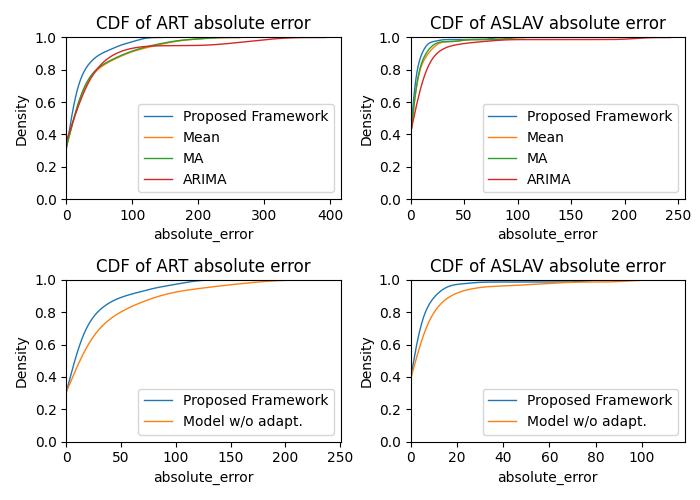

## Overview
Existing Fog computing schedulers rely on a **digital-twin co-simulator** to estimate Quality of Service (QoS) before committing to a decision. In most existing approaches, this simulator assumes **static workload arrival patterns**, which means its predictions quickly become unrepresentative when the real traffic changes.

This work introduces an **online adaptive arrival forecasting framework** that couples a QoS co-simulator with a **change-point detection module** and a **probabilistic transformer model**. Together, they track concept drift in task arrivals and continuously refresh the simulator’s input traces so that QoS estimates remain accurate over time.

---

## The problem

### Context
Fog computing places latency-sensitive applications close to users (on edge/fog nodes) while pushing compute-intensive components to the cloud. This architecture reduces latency and improves privacy, but it also makes **resource allocation and scheduling** much harder: fog nodes are constrained in compute, memory, and sometimes energy.

To help, co-simulation has been proposed as a **digital twin**: a runtime simulator that predicts QoS (such as response time and SLA violations) for candidate scheduling decisions. A scheduler can then choose the action that is likely to perform best.

### What is missing
Existing co-simulation approaches almost always assume:
- **Fixed or artificially parameterized arrival processes**, and  
- **No major structural changes** in traffic patterns (no concept drift).

In reality, fog workloads change:
- User behavior shifts over hours, days, or events.
- New services are deployed, old ones are removed.
- Arrival rates and variability (mean and variance) both drift.

A co-simulator that works with **out-of-date arrival traces** yields **biased QoS predictions**, which then misguide the scheduler.

### Why this matters
If the digital twin cannot reflect current workload conditions, then:
- **Scheduling decisions become suboptimal or even harmful**,  
- SLA violations and response times are underestimated or misestimated, and  
- The supposed benefit of co-simulation—better QoS through better foresight—is lost.

The central challenge is therefore:  
**How can we keep the co-simulator’s arrival traces aligned with the real, drifting workload in an online, computationally feasible way?**

---

## Key idea
The paper couples QoS co-simulation with **online adaptive arrival forecasting**, built around two components: 

  

1. A **hierarchical change-point detection (HCPD)** algorithm that can detect both:
   - shifts in the mean (“location shifts”), and  
   - shifts in the variability (“scale shifts”) of the arrival process.

2. A **probabilistic transformer model** that forecasts the **distribution** of future arrivals (rather than point predictions), specifically modeling arrivals as negative binomial count data.

When HCPD detects a change in the arrival series, the framework:
- updates a buffer with post-change data only, and  
- fine-tunes the transformer on this recent segment.
The updated transformer then generates **new, distribution-aware arrival traces** for the co-simulator, so that QoS predictions are always based on the latest observed regime.

---

## Approach

### 1. Digital-twin co-simulation setup
The fog system is modeled as:
- a gateway receiving tasks,
- a broker that schedules them to hosts, and
- a co-simulator that, given arrival traces, simulates execution and outputs QoS metrics such as:
  - Average Response Time (ART)
  - Average SLA Violation (ASLAV)

The co-simulator is integrated with the COSCO framework, which uses realistic task traces and host models to evaluate scheduling decisions.  

### 2. Hierarchical change-point detection (HCPD)
To track concept drift in arrivals, the framework extends existing hierarchical change detection by: 
- incorporating **DD+-CUSUM** to detect both increases and decreases in scale (variance), and  
- combining this with location-shift detection in a hierarchical structure.

HCPD runs online on the arrival series, raising a change-point alarm when it detects that the underlying distribution has shifted.

### 3. Probabilistic transformer for arrival forecasting

  

Instead of predicting future counts directly, the model: 
- takes a window of recent arrivals as input,
- uses a transformer encoder–decoder with ProbSparse attention to efficiently handle longer sequences, and  
- outputs parameters (µ, α) of a **negative binomial** distribution for each future step.

This yields a full **probabilistic forecast** of future arrivals, which is more suitable for count data and for feeding a simulator.

### 4. Online adaptive framework
The adaptive loop (Algorithm 1 in the paper) works as follows:

1. **Offline phase**
   - Run HCPD on historical traces to identify change points.
   - Train the transformer on **change-free segments** to avoid mixing regimes and simplify learning.

2. **Online phase**
   - Continuously monitor arrivals with HCPD.
   - When a change point is detected:
     - reset the buffer to keep only post-change arrivals,
     - once enough new data is collected, fine-tune the transformer on this recent segment.
   - Use the updated transformer to:
     - sample multiple possible future arrival series,  
     - feed them to the co-simulator, and  
     - average QoS outcomes to obtain robust ART and ASLAV estimates.

This yields a co-simulation loop that **adapts as the environment drifts**, without retraining from scratch.

---

## What we found

The framework is evaluated on:
- a **synthetic arrival trace** with 20 injected change points, and  
- a **real-world Alibaba 2018 cluster trace** with arrivals from thousands of machines over multiple days.

Results:

  

- **Forecasting and QoS estimation vs time-series baselines**  
  Compared to mean prediction, MA, and ARIMA:
  - the adaptive framework yields **substantially lower MAE** for ART and ASLAV in co-simulation,
  - e.g., up to **27% lower ART error** and **39% lower ASLAV error** on the Alibaba trace.

- **Effect of adaptation**  
  Removing the adaptation (no HCPD, no fine-tuning) worsens QoS estimation:
  - errors in ART and ASLAV increase relative to the full adaptive framework,
  - showing that **tracking concept drift online materially improves digital-twin accuracy**.

---

## Why this matters
This work demonstrates that **digital twins for fog systems must adapt their workload models** if they are to remain trustworthy in real environments.  

By combining:
- change-point detection for **when** the workload has drifted, and  
- a probabilistic transformer for **how** to forecast the new regime,  

the framework maintains **accurate QoS predictions** under non-stationary arrivals. This, in turn, enables:
- more robust scheduling and resource allocation,
- fewer unexpected SLA violations,
- and a more realistic application of co-simulation in production fog/edge systems.

Beyond fog computing, the same design pattern, **adaptive probabilistic forecasting feeding a digital twin**, applies to any system where performance depends on non-stationary arrival patterns.

## Citation
Chen, Y., Roveri, M., Tuli, S., Casale, G.  **“Coupling QoS Co-Simulation with Online Adaptive Arrival Forecasting.”**  2023 19th International Conference on Network and Service Management (CNSM)