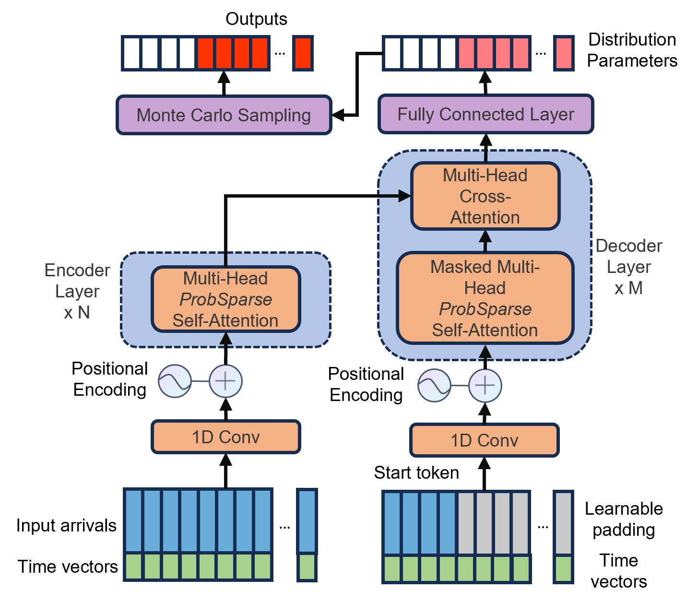
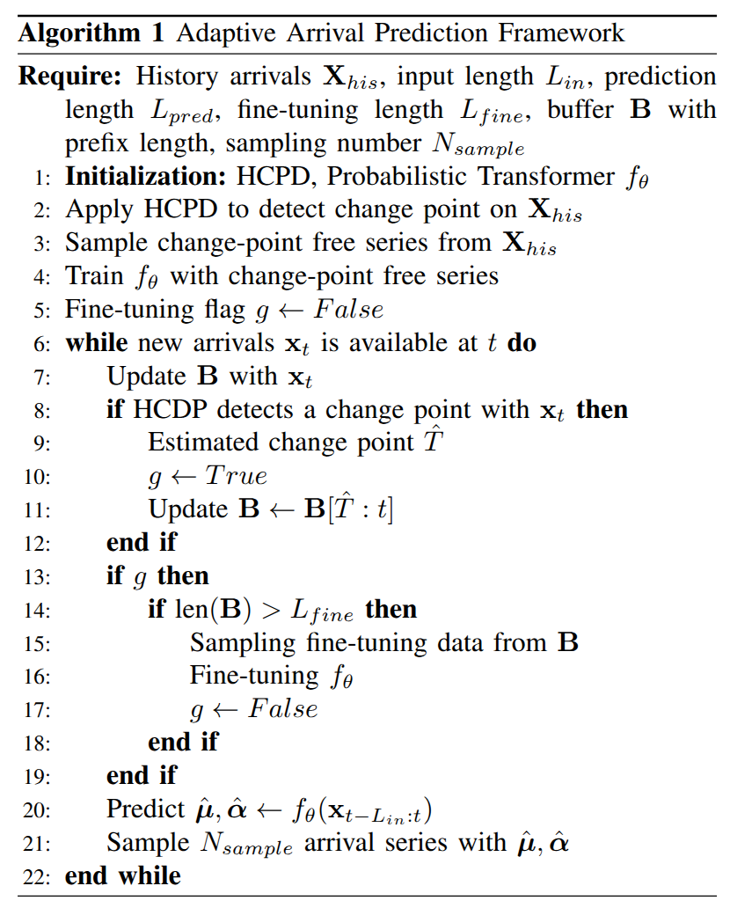

# Coupling QoS Co-Simulation with Online Adaptive Arrival Forecasting

## Introduction
Co-simulation, which simulates the response of a complex system to real-time changes, has been used as a digital-twin of a Fog system to help scheduling algorithms gain knowledge of the system and boost the scheduler to achieve better Quality of Service (QoS). However, the static setting of the parameters of the arrival process cannot mimic concept drifts in a real-world system which impedes the co-simulator from providing valuable estimations.

Therefore, we present an online adaptive framework to adapt the arrival generation model to the dynamic environment. The adaptive framework uses a change point detection module to monitor the arrival series online and fine-tune the transformer model after change points are detected in the arrival series.

Our experiments show that our online adaptive forecasting framework has lower forecasting errors than established prediction models, such as autoregressive processes, and lower on real-world traces the co-simulator prediction error by up to 27% on average response time and 39% on average service-level agreement (SLA) violation.

## Adaptive Arrival Forecasting Framework
We present a hierarchical framework to predict a long-time arrival series for the co-simulator to estimate the performance metrics of the new arrival tasks
### Hierarchical Change Point Detection
We present a non-parametric hierarchical change point detection (HCPD) method to detect and estimate change point in the arrival series. To detect both location and scale shifts in the time series, we apply MCUSUM and DD+-CUSUM change detection algorithms.
#### MCUSUM

#### DD+-CUSUM
The data depth $\textit{R}$ statistic measures the distance between an observation and the mean of a distribution. Given observed arrivals $\mathbf{x}_t$, the data depth can be formulated as

$$ 
DD_{\Phi_0}(\mathbf{x}_t) = 1 - ||E_{\Phi_0}(U(\mathbf{x}_t-\mathbf{y}))||, 
$$

where $\mathbf{y}\sim \Phi_0$ is data from distribution $\Phi_0$, and the operation $U(x) = \frac{x}{||x||}$. Thus, $DD_{\Phi_0}(\mathbf{x})$ is close to $0$ if the observation $\mathbf{x}$ is far away from the center of the distribution $\Phi_0$. On the contrary, $DD_{\Phi_0}(\mathbf{x})$ becomes large and attains the maximum value $1$ if the observation is near the center of $\Phi_0$. In a change detection problem with a given historical data set ${\mathbf{y}_1, \dots, \mathbf{y}_m}$, the sample data depth is defined as

$$ 
DD_{\hat{\Phi}_0}(\mathbf{x}_t) = 1 - \frac{1}{m}{\left\lVert\sum_{i=1,\mathbf{y}_i\neq \mathbf{x}_t}^mU(\mathbf{x}_t-\mathbf{y}_i)\right\rVert} 
$$

where $\hat{\Phi}_0$ represents the empirical distribution of the data.

The data depth $\textit{R}$ to detect increase of scale is calculated from

$$
    \textit{R}_{\hat{\Phi}_0}^+(\mathbf{x}_t) = \frac{\sum_{i=1}^m I(DD_{\hat{\Phi}_0}(\mathbf{y}_i) \leq DD_{\hat{\Phi}_0}(\mathbf{x}_t))}{m}
$$

which is the count of the historical data with a large data depth compared to the new observation. If the new observation $\mathbf{x}_t$ is near the center of the historical data set $\mathbf{y}_i$, the data depth of $\mathbf{x}_t$ would be greater than most of the historical data, which leads to a large $\textit{R}$ statistic value. Hence, $1-\textit{R}_{\hat{\Phi}_0}^+(\mathbf{x}_t)$ can represent the distance between $\mathbf{x}_t$ and the empirical distribution of the historical data.

To detect decrease of scale, $\textit{R}$ is comuted as:

$$
    \textit{R}_{\hat{\Phi}_0}^-(\mathbf{x}_t) = \frac{\sum_{i=1}^m I(DD_{\hat{\Phi}_0}(\mathbf{y}_i) \geq DD_{\hat{\Phi}_0}(\mathbf{x}_t))}{m} 
$$

Then, $\text{DD}^+\text{-CUSUM}$ cumulatively sums both positive and negative $\textit{R}$ statistic measures and the control chart is performed on the one with the maximum value. The complete $\text{DD}^+\text{-CUSUM}$ can be formed as follow:

$$
    S^+_t = \max(0, S^+_{t-1}+(1-\textit{R}^+_{\hat{\Phi}_0}(\mathbf{x}_t))-k) \\
    S^-_t = \max(0, S^-_{t-1}+(1-\textit{R}^-_{\hat{\Phi}_0}(\mathbf{x}_t))-k) \\
    S_t = \max(S^+_t, S^-_t)
$$

$\text{DD}^+\text{-CUSUM}$ detects a change when $S_t>h$.

### Arrival Series Forecasting
We design a transformer based encoder-decoder model with the \textit{ProbSparse} attention as the self-attention module to predict the long-term arrival series. The overall structure of our transformer model is shown below:

  

The encoder takes the input arrival series and the time features as the input. The time features of the arrival series are represented in vector form and concatenated with the input arrival series as extra features. The input series is first processed with a 1-D convolution layer to project the input series $\mathbf{X}\in \mathbb{R}^{L_{enc}\times d}$ into a high dimensions space so that $\mathbf{X}'\in \mathbb{R}^{L_{enc}\times d_{model}}$. The projected series is processed with a positional encoding layer to encode order features into the series.

In a standard encoder-decoder transformer model, the decoder takes the output of the encoder and a start token or its previous predictions as the input and makes the next prediction. However, the previous predictions are unavailable at the beginning under the co-simulation scenario. Meanwhile, the model is required to have fast inference speed to avoid long scheduling time. We set a sequence of learnable parameters with the length of maximum prediction $L_{max}$ to replace the zero paddings. In the meantime, a subsequence of the input series of the encoder with length $L_{start}$ works as the start token of the decoder. Therefore, the start subsequence and the learnable padding parameters form the input series of the decoder $\mathbf{X}_{dec}\in\mathbb{R}^{(L_{start}+L_{max})\times d}$. The timestamps are also added as the time features to the corresponding input.

Instead of directly predicting the number of future arrivals, we predict the parameters of the distribution of the future arrival. Since the arrival series is a sequence of positive count data, our transformer model predicts the parameters of a negative binomial distribution.

### Adaptive Arrival Prediction Framework

  

