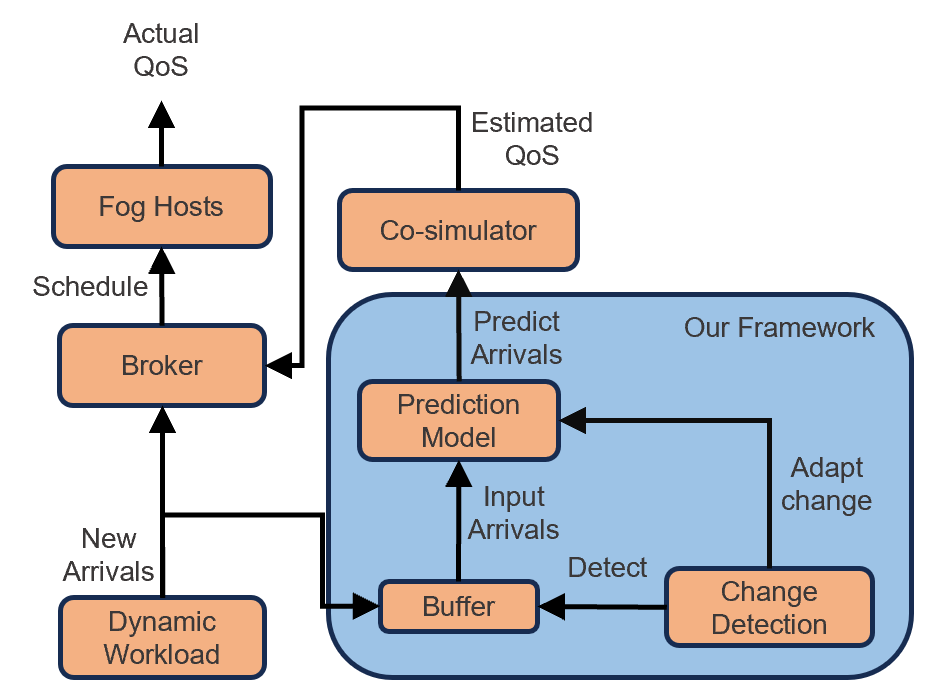

# Coupling QoS Co-Simulation with Online Adaptive Arrival Forecasting

## Introduction
Co-simulation, which simulates the response of a complex system to real-time changes, has been used as a digital-twin of a Fog system to help scheduling algorithms gain knowledge of the system and boost the scheduler to achieve better Quality of Service (QoS). However, the static setting of the parameters of the arrival process cannot mimic concept drifts in a real-world system which impedes the co-simulator from providing valuable estimations.

Therefore, we present an online adaptive framework to adapt the arrival generation model to the dynamic environment. The adaptive framework uses a change point detection module to monitor the arrival series online and fine-tune the transformer model after change points are detected in the arrival series.

Our experiments show that our online adaptive forecasting framework has lower forecasting errors than established prediction models, such as autoregressive processes, and lower on real-world traces the co-simulator prediction error by up to 27% on average response time and 39% on average service-level agreement (SLA) violation.

## Problem

  

We consider a dynamic Fog system that contains a digital-twin co-simulator, which is used to estimate the QoS of the system, as shown in Fig.1. The Fog system receives tasks from a gateway that collects tasks and sends them to the broker. The scheduling decisions are made by the broker based on the QoS estimates from the co-simulator. The tasks are executed on the assigned hosts, and the actual QoS is computed.

The distribution of the arrival process can change over time. We wish to design a framework that predicts the number of arrivals in $L$ step ahead with the last $t_0$ observation of arrivals and adapt the prediction model when concept drift occurs on the distribution of the arrivals. The prediction and adaptation mechanism form our proposed framework.

## Adaptive Arrival Forecasting Framework
we present a hierarchical framework to predict a long-time arrival series for the co-simulator to estimate the performance metrics of the new arrival tasks with the default scheduling policy.

### Hierarchical Change Point Detection
We present a non-parametric hierarchical change point detection (HCPD) method to detect and estimate change point in the arrival series. To detect both location and scale shifts in the time series, we apply $\text{MCUSUM}$ and $\text{DD}^+\text{-CUSUM}$ change detection algorithms.

The $\text{MCUSUM}$ and $\text{DD}^+\text{-CUSUM}$ monitor the arrival simultaneously and store the new observation in a buffer with a prefix size. The buffer drops the oldest observation and adds the newest one if the buffer reaches its size limit. HCPD detects a potential change if either one of these two CUSUM algorithms raises a detection flag. 

Once the detection algorithms trigger the alarm, a validation module uses the Lepage-type (LP) hypothesis test, which can detect both location and scale shifts, to validate the change and estimate the change point with the stored data in the buffer. We calculate the LP test value on every possible splitting and performance hypothesis test on the one with the maximum.  If the LP test confirms the change exists, we consider the splitting point with the maximum statistical test value as the estimated change point.

### Arrival Series Forecasting
We design a transformer based encoder-decoder model with the \textit{ProbSparse} attention as the self-attention module to predict the long-term arrival series. The overall structure of our transformer model is shown below:

  

The encoder takes the input arrival series and the time features as the input. The time features of the arrival series are represented in vector form and concatenated with the input arrival series as extra features. The input series is first processed with a 1-D convolution layer to project the input series $\mathbf{X}\in \mathbb{R}^{L_{enc}\times d}$ into a high dimensions space so that $\mathbf{X}'\in \mathbb{R}^{L_{enc}\times d_{model}}$. The projected series is processed with a positional encoding layer to encode order features into the series.

In a standard encoder-decoder transformer model, the decoder takes the output of the encoder and a start token or its previous predictions as the input and makes the next prediction. However, the previous predictions are unavailable at the beginning under the co-simulation scenario. Meanwhile, the model is required to have fast inference speed to avoid long scheduling time. We set a sequence of learnable parameters with the length of maximum prediction $L_{max}$ to replace the zero paddings. In the meantime, a subsequence of the input series of the encoder with length $L_{start}$ works as the start token of the decoder. Therefore, the start subsequence and the learnable padding parameters form the input series of the decoder $\mathbf{X}_{dec}\in\mathbb{R}^{(L_{start}+L_{max})\times d}$. The timestamps are also added as the time features to the corresponding input.

Instead of directly predicting the number of future arrivals, we predict the parameters of the distribution of the future arrival. Since the arrival series is a sequence of positive count data, our transformer model predicts the parameters of a negative binomial distribution.

### Adaptive Arrival Prediction Framework

  

The algorithm illustrate the procedure of the adaptive arrival prediction framework.

## Results
We evaluate two workload traces and report the mean absolute error (MAE) of ART and ASLAV for each forecasting model:

### Table: MAE of ART and ASLAV Estimated with Forecasting Models

<table style="border-collapse: collapse; margin: 20px auto;">
  <thead>
    <tr>
      <th style="border: 1px solid #666; padding: 12px 16px; background-color: rgba(255, 255, 255, 0.05); font-weight: bold;">Model</th>
      <th style="border: 1px solid #666; padding: 12px 16px; background-color: rgba(255, 255, 255, 0.05); font-weight: bold;">Metric</th>
      <th style="border: 1px solid #666; padding: 12px 16px; background-color: rgba(255, 255, 255, 0.05); font-weight: bold;">Synthetic trace</th>
      <th style="border: 1px solid #666; padding: 12px 16px; background-color: rgba(255, 255, 255, 0.05); font-weight: bold;">Alibaba trace</th>
    </tr>
  </thead>
  <tbody>
    <tr>
      <td rowspan="2" style="border: 1px solid #666; padding: 12px 16px; text-align: center; vertical-align: middle;"><strong>Mean</strong></td>
      <td style="border: 1px solid #666; padding: 12px 16px;">ART</td>
      <td style="border: 1px solid #666; padding: 12px 16px; text-align: center;">24.97</td>
      <td style="border: 1px solid #666; padding: 12px 16px; text-align: center;">40.33</td>
    </tr>
    <tr>
      <td style="border: 1px solid #666; padding: 12px 16px;">ASLAV</td>
      <td style="border: 1px solid #666; padding: 12px 16px; text-align: center;">4.58</td>
      <td style="border: 1px solid #666; padding: 12px 16px; text-align: center;">18.59</td>
    </tr>
    <tr>
      <td rowspan="2" style="border: 1px solid #666; padding: 12px 16px; text-align: center; vertical-align: middle;"><strong>MA</strong></td>
      <td style="border: 1px solid #666; padding: 12px 16px;">ART</td>
      <td style="border: 1px solid #666; padding: 12px 16px; text-align: center;">24.17</td>
      <td style="border: 1px solid #666; padding: 12px 16px; text-align: center;">52.84</td>
    </tr>
    <tr>
      <td style="border: 1px solid #666; padding: 12px 16px;">ASLAV</td>
      <td style="border: 1px solid #666; padding: 12px 16px; text-align: center;">7.45</td>
      <td style="border: 1px solid #666; padding: 12px 16px; text-align: center;">23.57</td>
    </tr>
    <tr>
      <td rowspan="2" style="border: 1px solid #666; padding: 12px 16px; text-align: center; vertical-align: middle;"><strong>ARIMA</strong></td>
      <td style="border: 1px solid #666; padding: 12px 16px;">ART</td>
      <td style="border: 1px solid #666; padding: 12px 16px; text-align: center;">26.16</td>
      <td style="border: 1px solid #666; padding: 12px 16px; text-align: center;">47.87</td>
    </tr>
    <tr>
      <td style="border: 1px solid #666; padding: 12px 16px;">ASLAV</td>
      <td style="border: 1px solid #666; padding: 12px 16px; text-align: center;">4.27</td>
      <td style="border: 1px solid #666; padding: 12px 16px; text-align: center;">22.96</td>
    </tr>
    <tr>
      <td rowspan="2" style="border: 1px solid #666; padding: 12px 16px; text-align: center; vertical-align: middle;"><strong>Our Model</strong></td>
      <td style="border: 1px solid #666; padding: 12px 16px;">ART</td>
      <td style="border: 1px solid #666; padding: 12px 16px; text-align: center;"><strong>15.28</strong></td>
      <td style="border: 1px solid #666; padding: 12px 16px; text-align: center;"><strong>31.74</strong></td>
    </tr>
    <tr>
      <td style="border: 1px solid #666; padding: 12px 16px;">ASLAV</td>
      <td style="border: 1px solid #666; padding: 12px 16px; text-align: center;"><strong>3.09</strong></td>
      <td style="border: 1px solid #666; padding: 12px 16px; text-align: center;"><strong>11.21</strong></td>
    </tr>
    <tr>
      <td rowspan="2" style="border: 1px solid #666; padding: 12px 16px; text-align: center; vertical-align: middle;"><strong>Model w/o adapt.</strong></td>
      <td style="border: 1px solid #666; padding: 12px 16px;">ART</td>
      <td style="border: 1px solid #666; padding: 12px 16px; text-align: center;">24.72</td>
      <td style="border: 1px solid #666; padding: 12px 16px; text-align: center;">34.87</td>
    </tr>
    <tr>
      <td style="border: 1px solid #666; padding: 12px 16px;">ASLAV</td>
      <td style="border: 1px solid #666; padding: 12px 16px; text-align: center;">5.38</td>
      <td style="border: 1px solid #666; padding: 12px 16px; text-align: center;">12.68</td>
    </tr>
  </tbody>
</table>

The table shows that our adaptive model achieves the best performance across both datasets, with significant improvements over baseline methods (Mean, MA, ARIMA) and the non-adaptive version of our model.
