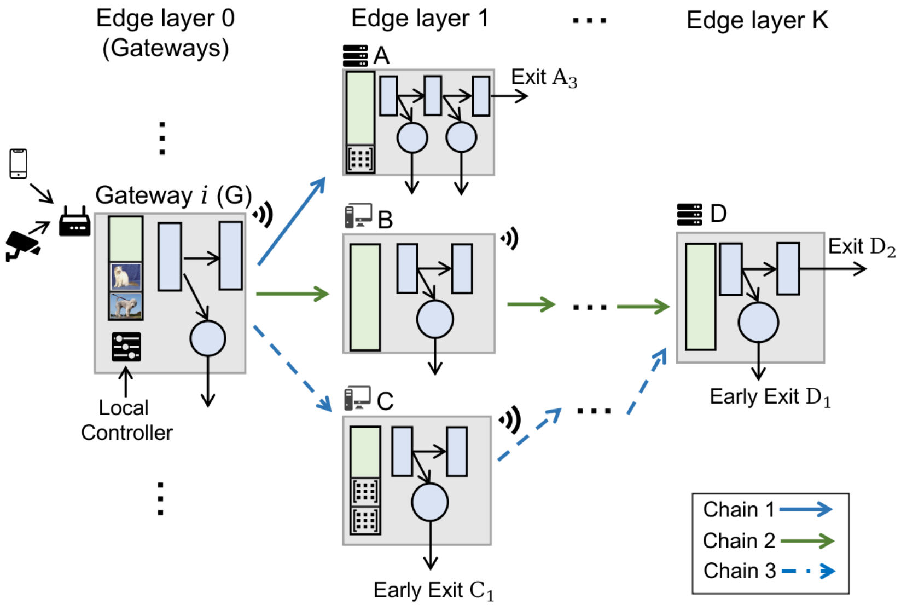
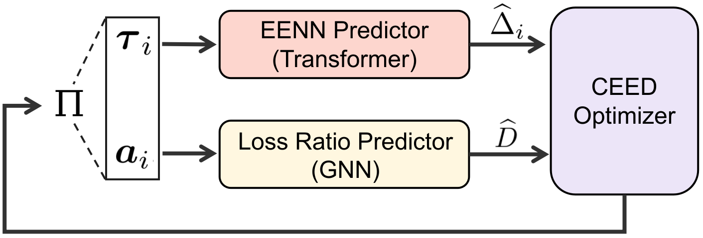
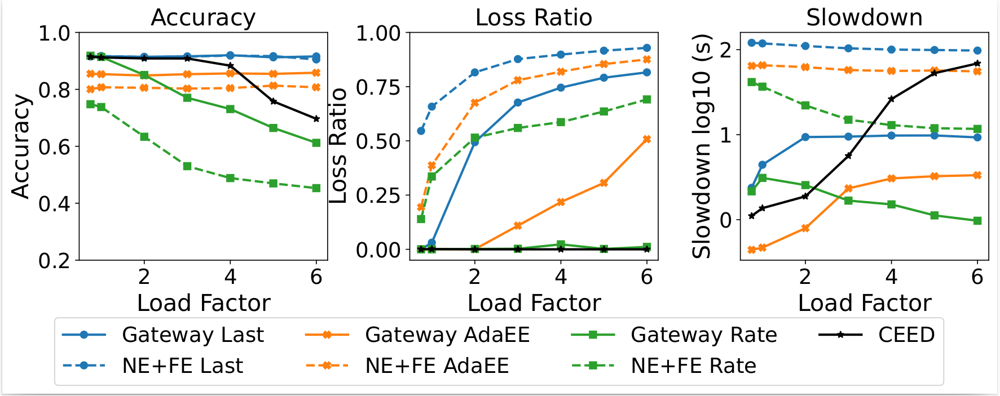
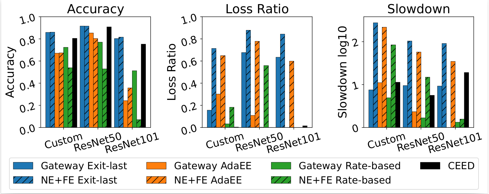

## Overview
Deep neural networks keep getting larger, and that creates a practical mismatch with edge devices that are limited in compute and memory. Early-Exit Neural Networks (EENNs) offer a useful compromise by allowing predictions to exit at intermediate classifiers when confidence of making good prediction is high. However, in **distributed** edge settings, the classic way of using EENNs with static thresholds and simplified arrival assumptions. This can lead to **memory overflow and data loss**.  

**CEED** addresses this by jointly optimizing early-exit thresholds and job routing across a multi-layer edge infrastructure, targeting a balanced Quality-of-Service (QoS) outcome rather than optimizing latency or accuracy in isolation.

---

## The problem
### Context

  

Collaborative inference is increasingly common at the edge. Instead of running a full model on one device, layers can be split and replicated across multiple devices in a layered edge topology. This can reduce per-device burden and enable more scalable inference pipelines.

### What is missing
Most distributed EENN approaches assume:
1. **Preset confidence thresholds**,  
2. **Constant/benign arrival behavior**,  
which hides a critical system reality: **edge devices have finite memory**. When buffers fill and incoming job sizes exceed remaining capacity, jobs get dropped. This creates a reliability gap that is not captured by accuracy/latency-only methods.

In real deployments, you want **high accuracy** and **acceptable response times**, but also **low loss ratios** so that the system remains dependable under load spikes and heterogeneous device performance.

## Approach

  

### Idea
CEED reframes distributed EENN control as a **joint optimization** problem:  
- choose **confidence threshold configurations** for early exits,  
- choose **chain assignment policies** that route jobs across possible device-layer paths.  

Instead of relying on expensive simulation or oversimplified analytical assumptions, CEED uses two learned predictors to rapidly score candidate policies.

CEED integrates two AI surrogates:

1. **Transformer-based EENN predictor**  
   Given a threshold vector for a gateway, the model predicts:
   - expected confidence scores per intermediate classifier,
   - exit probabilities across layers.  
   This captures the sequential dependency of thresholds and early-exit behavior.{index=4}

2. **GNN-based loss ratio predictor**  
   The system is modeled as a queueing network with finite-capacity regions (to reflect memory limits).  
   The GNN predicts system-level loss outcomes without running costly simulations for every new configuration. 

With these two predictors, CEED performs gradient-based optimization on a reward that:
- increases mean confidence (a proxy for accuracy), and
- penalizes loss ratio above a target threshold.

---

## What we found
Experiments on a **physical 3-layer testbed** with Raspberry Pis (gateway + near-edge) and a stronger far-edge device show that CEED improves the practical QoS trade-off. The evaluation includes multiple EENNs (custom CNN, ResNet50, ResNet101) and datasets (CIFAR10, ImageNet-1K).

  

  

Key takeaways:
- Under rising load, **static or purely accuracy-driven policies** can preserve accuracy but suffer higher loss ratios.  
- **Rate-based early-exit strategies** can reduce loss but often do so by sacrificing accuracy.  
- **CEED maintains higher accuracy than rate-based methods while strongly limiting loss**, and also reduces slowdown compared with “always exit at last layer” strategies in heavily loaded conditions.
- CEED remains effective as EENN size grows, where RL-based baselines struggle with action-space scalability. 

## Citation
Chen, Y., Niu, Z., Roveri, M., Casale, G.,**“CEED: Collaborative Early Exit Neural Network Inference at the Edge.”** IEEE INFOCOM, 2025.
